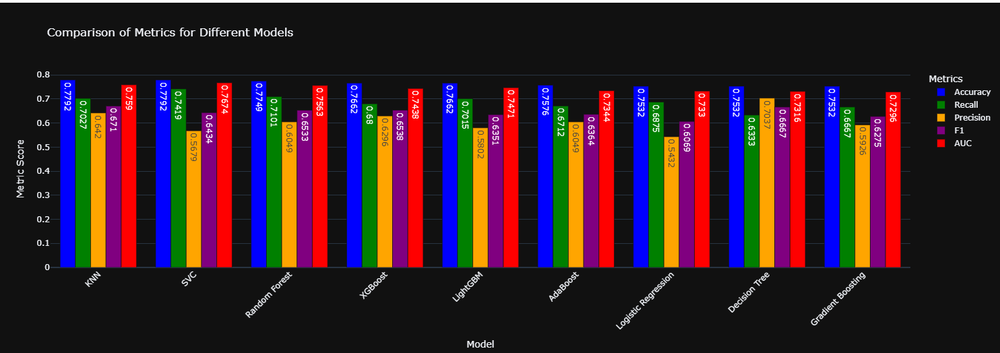
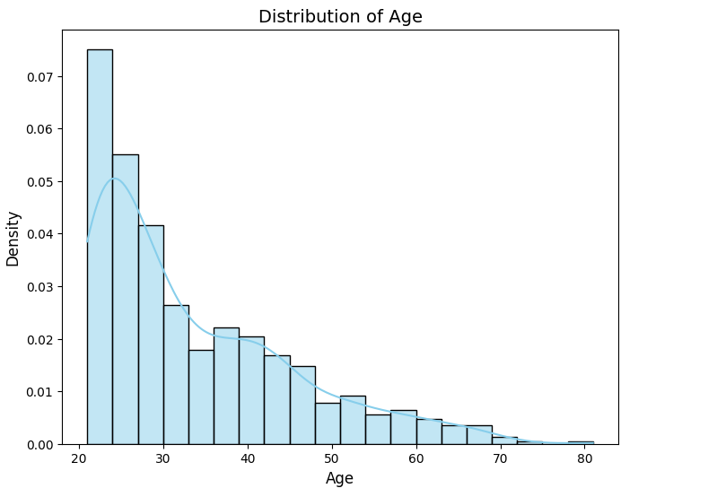
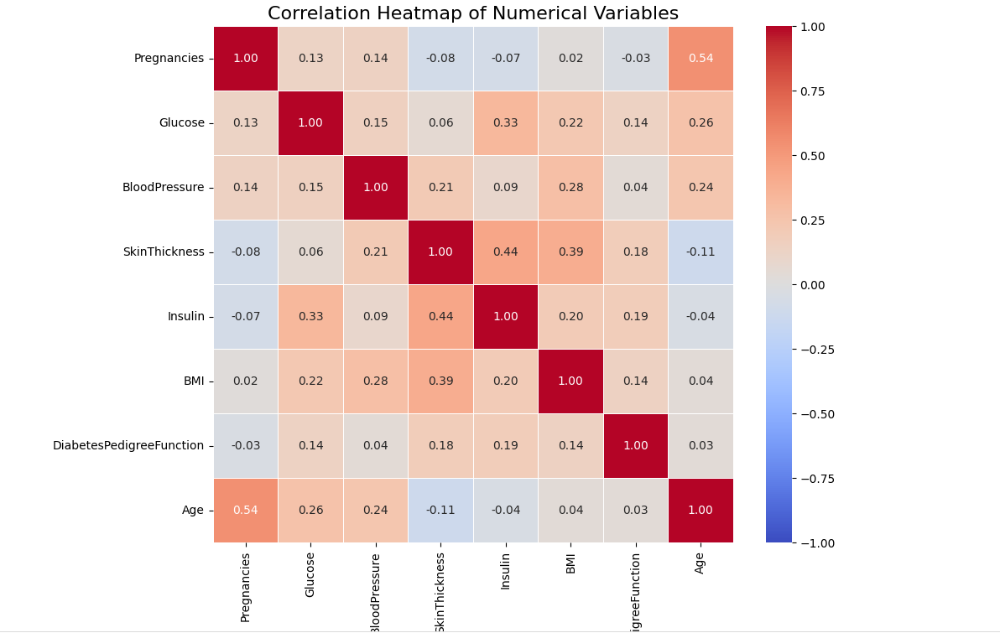
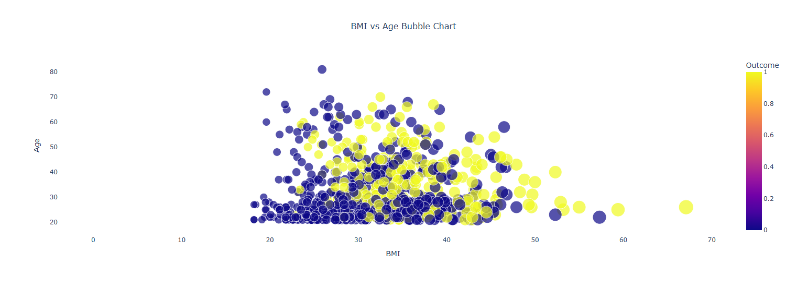
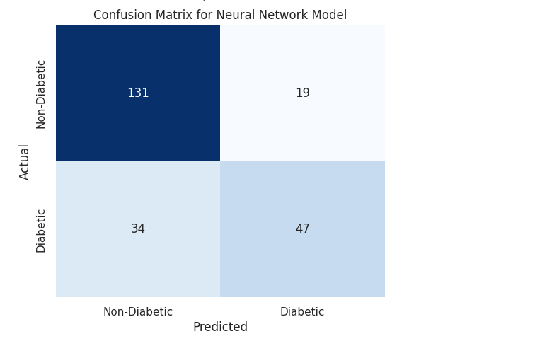

# Predicting Diabetes Diagnosis Using Machine Learning 📊💉

Diabetes remains a critical global health challenge, affecting millions annually. Early diagnosis is essential for improving patient outcomes, and this project is dedicated to developing a **machine learning model** aimed at predicting whether a patient has diabetes based on key medical data. 🧑‍⚕️💡

We leverage a dataset from the **National Institute of Diabetes and Digestive and Kidney Diseases**, specifically focusing on **female patients of Pima Indian heritage, aged 21 and older**. The dataset includes various medical attributes such as glucose levels, blood pressure, BMI, and more. The goal is to analyze these features to create an **accurate and reliable predictive model** that can aid healthcare professionals in early diagnosis and decision-making. 📈🔍

The goal is to build a **robust, interpretable model** with high accuracy, providing insights into the factors influencing diabetes diagnosis and offering a powerful tool for early detection and intervention. 🏥🔬

<p align="center">
   
   
   
   
   
   
   
</p>

🙏 I would like to extend my heartfelt gratitude to [Santiago Hernández, an expert in Cybersecurity and Artificial Intelligence](https://www.udemy.com/user/shramos/). His incredible course on Deep Learning, available at Udemy, was instrumental in shaping the development of this project. The insights and techniques learned from his course were crucial in crafting the neural network architecture used in this classifier.

## 🌟 Explore My Other Cutting-Edge AI Projects! 🌟

If you found this project intriguing, I invite you to check out my other AI and machine learning initiatives, where I tackle real-world challenges across various domains:

+ [🌍 Advanced Classification of Disaster-Related Tweets Using Deep Learning 🚨](https://github.com/sergio11/disasters_prediction)  
Uncover how social media responds to crises in real time using **deep learning** to classify tweets related to disasters.

+ [📰 Fighting Misinformation: Source-Based Fake News Classification 🕵️‍♂️](https://github.com/sergio11/fake_news_classifier)  
Combat misinformation by classifying news articles as real or fake based on their source using **machine learning** techniques.

+ [🛡️ IoT Network Malware Classifier with Deep Learning Neural Network Architecture 🚀](https://github.com/sergio11/iot_network_malware_classifier)  
Detect malware in IoT network traffic using **Deep Learning Neural Networks**, offering proactive cybersecurity solutions.

+ [📧 Spam Email Classification using LSTM 🤖](https://github.com/sergio11/spam_email_classifier_lstm)  
Classify emails as spam or legitimate using a **Bi-directional LSTM** model, implementing NLP techniques like tokenization and stopword removal.

+ [💳 Fraud Detection Model with Deep Neural Networks (DNN)](https://github.com/sergio11?tab=repositories)  
Detect fraudulent transactions in financial data with **Deep Neural Networks**, addressing imbalanced datasets and offering scalable solutions.

+ [🧠🚀 AI-Powered Brain Tumor Classification](https://github.com/sergio11/brain_tumor_classification_cnn)  
Classify brain tumors from MRI scans using **Deep Learning**, CNNs, and Transfer Learning for fast and accurate diagnostics.

+ [📊💉 Predicting Diabetes Diagnosis Using Machine Learning](https://github.com/sergio11/diabetes_prediction_ml)  
Create a machine learning model to predict the likelihood of diabetes using medical data, helping with early diagnosis.

+ [🚀🔍 LLM Fine-Tuning and Evaluation](https://github.com/sergio11/llm_finetuning_and_evaluation)  
Fine-tune large language models like **FLAN-T5**, **TinyLLAMA**, and **Aguila7B** for various NLP tasks, including summarization and question answering.

+ [📰 Headline Generation Models: LSTM vs. Transformers](https://github.com/sergio11/headline_generation_lstm_transformers)  
Compare **LSTM** and **Transformer** models for generating contextually relevant headlines, leveraging their strengths in sequence modeling.

+ [🩺💻 Breast Cancer Diagnosis with MLP](https://github.com/sergio11/breast_cancer_diagnosis_mlp)  
Automate breast cancer diagnosis using a **Multi-Layer Perceptron (MLP)** model to classify tumors as benign or malignant based on biopsy data.

## Tools, Techniques, and Models 🔧🧠

This project employs a diverse set of machine learning techniques to preprocess, build, and optimize the prediction model:

### 1. **Exploratory Data Analysis (EDA)** 🔎
   - **Objective**: Understand the data distribution, detect missing values, and analyze correlations between features.
   - **Methods**: Visualizations like histograms, boxplots, and correlation matrices to uncover insights that guide feature selection.

### 2. **Feature Engineering** ⚙️
   - **Objective**: Identify and create the most relevant features to improve model performance.
   - **Techniques**: Handling missing data, encoding categorical variables, scaling numerical features, and feature selection based on correlation analysis.

### 3. **Data Preprocessing** 🔄
   - **Objective**: Prepare the data for modeling, ensuring it's clean, scaled, and transformed appropriately.
   - **Steps**: 
     - **Imputation**: Missing data is handled using methods like KNN imputation.
     - **Scaling**: Features are normalized using **RobustScaler** to ensure uniformity in model input.
     - **Handling Outliers**: Outliers are detected and replaced using threshold values to avoid skewing the model’s predictions.

### 4. **Machine Learning Algorithms** 🤖

   We employ a variety of well-established machine learning models to predict diabetes and compare their effectiveness. Each model is evaluated based on key metrics like **accuracy**, **precision**, **recall**, **F1 score**, and **AUC**. Here’s a quick overview of the models used:

   - **Random Forest Classifier 🌲**: 
     - A robust ensemble method that constructs multiple decision trees to reduce overfitting and improve accuracy.
     - Known for handling imbalanced datasets well and providing feature importance insights.

   - **Logistic Regression 📊**: 
     - A simple yet effective model used for binary classification problems. It provides probabilistic outputs and is easy to interpret.
     - Best for linearly separable problems, but can struggle with complex relationships.

   - **K-Nearest Neighbors (KNN) 🤝**: 
     - A non-parametric model that classifies a data point based on the majority label of its nearest neighbors.
     - Performs well with smaller datasets, but can be computationally expensive and sensitive to irrelevant features.

   - **Support Vector Classifier (SVC) 🧱**: 
     - This model works by finding the optimal hyperplane that separates the data into classes.
     - Especially effective in high-dimensional spaces, but can be sensitive to noisy data and requires proper kernel selection.

   - **Decision Tree Classifier 🌳**: 
     - A simple, interpretable model that splits data based on feature thresholds to form a tree-like structure.
     - Prone to overfitting but easy to visualize and interpret.

   - **AdaBoost Classifier 🚀**: 
     - An ensemble method that combines weak classifiers to form a stronger model. It adjusts the weights of misclassified instances to improve performance.
     - Effective in improving the performance of weak models, though susceptible to noise.

   - **Gradient Boosting Classifier 📈**: 
     - A sequential ensemble method that builds trees one at a time, each correcting errors made by previous ones.
     - Known for high predictive power but prone to overfitting if not properly tuned.

   - **XGBoost Classifier 🌟**: 
     - An optimized version of Gradient Boosting, which uses advanced regularization techniques to prevent overfitting and speed up computation.
     - One of the top performers in Kaggle competitions, highly efficient and robust for large datasets.

   - **LightGBM Classifier 💡**: 
     - A gradient boosting framework that uses histogram-based techniques to speed up the training process and reduce memory consumption.
     - Works well with large datasets and high-dimensional data.



### 5. **Deep Learning Model with Keras 🧠**
   - **Objective**: Build a neural network model with multiple dense layers to capture complex non-linear relationships in the data.
   - **Architecture**:
     - Input layer with 128 neurons.
     - Hidden layers with 64, 32, and 16 neurons respectively.
     - Dropout and Batch Normalization to improve generalization and prevent overfitting.
   - **Optimization**: The model is trained using the **Adam optimizer** and **binary cross-entropy loss** to predict diabetes diagnosis with a high degree of accuracy.



### 6. **Model Optimization and Evaluation 🔧**
   - **Hyperparameter Tuning**: Grid search and randomized search techniques are applied to tune model parameters for optimal performance.
   - **Evaluation Metrics**: Each model is evaluated based on accuracy, precision, recall, F1 score, and AUC (Area Under the Curve).
   - **Cross-validation**: K-fold cross-validation is used to evaluate model stability and avoid overfitting.



## Results and Insights 📊

The models were evaluated based on their predictive performance and interpretability. Below are the key takeaways:

- **Deep Learning Model**:
   - Achieved strong performance with **accuracy** around **77.49%**.
   - The model’s **AUC** value was also promising, showing good discriminatory power between diabetic and non-diabetic cases.
   - The neural network model performed well with complex data, demonstrating its capability in capturing non-linear relationships.

- **Traditional Models**:
   - **XGBoost** and **Random Forest** were among the top performers with **accuracy** scores around **77-78%**.
   - **Logistic Regression** and **SVC** offered decent performance but struggled to match the deep learning model’s capacity for non-linear data.
   - **KNN**, **AdaBoost**, and **Gradient Boosting** performed well but faced challenges in handling complex patterns without proper hyperparameter tuning.



### **Key Insights**:
- **Deep Learning** proved to be effective in terms of predictive power, but it requires more computational resources compared to traditional models.
- **XGBoost**, **Random Forest**, and **SVC** performed similarly with competitive accuracy, making them viable alternatives for scenarios with less data or fewer resources.
- **Logistic Regression** is a strong baseline model for binary classification tasks, while **KNN** and **AdaBoost** can be useful in simpler, well-defined problems.


## Conclusion 🏁

This project demonstrates the power of machine learning in predicting diabetes diagnosis using a variety of models, including **deep learning** and traditional classifiers. The models tested show different strengths, with **XGBoost**, **Random Forest**, and **SVC** providing strong performance in terms of **accuracy** and **AUC**. However, the **deep learning model** offers an edge in handling more complex data, provided that computational resources are available.

By carefully selecting the right model based on the problem at hand, healthcare professionals can significantly improve the **early detection of diabetes**, ultimately aiding in better treatment and outcomes for patients.

## **📚 References**
- [Keras Documentation](https://keras.io/)
- [TensorFlow Documentation](https://www.tensorflow.org/)
- [Diabetes EDA ML prediction Mehmetisik](https://www.kaggle.com/code/mehmetisik/diabetes-eda-ml-prediction)
- [Kaggle Dataset](https://www.kaggle.com/datasets/akshaydattatraykhare/diabetes-dataset)

## **🙏 Acknowledgments**

A huge **thank you** to **Akshay Dattatray Khare** for providing the dataset that made this project possible! 🌟 The dataset can be found on [Kaggle](https://www.kaggle.com/datasets/akshaydattatraykhare/diabetes-dataset). Your contribution is greatly appreciated! 🙌

A special thank you to **Mehmet ISIK** for the invaluable inspiration provided through his project, [**Diabetes EDA & ML Prediction**](https://www.kaggle.com/code/mehmetisik/diabetes-eda-ml-prediction). His work laid the foundation for the development of this model and greatly influenced the approach taken in this project. The insights and techniques explored in his work served as a key resource, helping to guide the creation of an effective and robust diabetes prediction model. We truly appreciate the effort and dedication put into his research and contributions to the data science community

🙏 I would like to extend my heartfelt gratitude to [Santiago Hernández, an expert in Cybersecurity and Artificial Intelligence](https://www.udemy.com/user/shramos/). His incredible course on Deep Learning, available at Udemy, was instrumental in shaping the development of this project. The insights and techniques learned from his course were crucial in crafting the neural network architecture used in this classifier.

## License ⚖️

This project is licensed under the MIT License, an open-source software license that allows developers to freely use, copy, modify, and distribute the software. 🛠️ This includes use in both personal and commercial projects, with the only requirement being that the original copyright notice is retained. 📄

Please note the following limitations:

- The software is provided "as is", without any warranties, express or implied. 🚫🛡️
- If you distribute the software, whether in original or modified form, you must include the original copyright notice and license. 📑
- The license allows for commercial use, but you cannot claim ownership over the software itself. 🏷️

The goal of this license is to maximize freedom for developers while maintaining recognition for the original creators.

```
MIT License

Copyright (c) 2025 Dream software - Sergio Sánchez 

Permission is hereby granted, free of charge, to any person obtaining a copy
of this software and associated documentation files (the "Software"), to deal
in the Software without restriction, including without limitation the rights
to use, copy, modify, merge, publish, distribute, sublicense, and/or sell
copies of the Software, and to permit persons to whom the Software is
furnished to do so, subject to the following conditions:

The above copyright notice and this permission notice shall be included in all
copies or substantial portions of the Software.

THE SOFTWARE IS PROVIDED "AS IS", WITHOUT WARRANTY OF ANY KIND, EXPRESS OR
IMPLIED, INCLUDING BUT NOT LIMITED TO THE WARRANTIES OF MERCHANTABILITY,
FITNESS FOR A PARTICULAR PURPOSE AND NONINFRINGEMENT. IN NO EVENT SHALL THE
AUTHORS OR COPYRIGHT HOLDERS BE LIABLE FOR ANY CLAIM, DAMAGES OR OTHER
LIABILITY, WHETHER IN AN ACTION OF CONTRACT, TORT OR OTHERWISE, ARISING FROM,
OUT OF OR IN CONNECTION WITH THE SOFTWARE OR THE USE OR OTHER DEALINGS IN THE
SOFTWARE.
```


